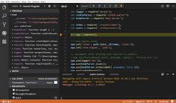

# First lecture in Java script?
# lecture 1
.jpg)

# About Java script?
## Javascript zaboni mashhuri barnomasozi asr ,ki taqriban 98 % web-sitehoro tashkil medihad.JavaScript was previously used mainly for making webpages interactive such as formvalidation, animation, etc. Nowadays, avaScript is also used in many other areas such as server-side development, mobile app development and so on.
.jopg)
# Dar borai tarikhi Js?
## 1995 - Brendan Eich Avvalin versiai Js - ri dar 10 ruz sokht. in mocha nom dosht , ki avvalin fundamentalhoi navi js karor dosht
## 1996 - nomi mocha badan ba live script tagir ioft va badan ba java script tagir ioft va dar haqikat sozandagoni javaro dar hairat guzosht dar hole ki java script chize nadosht
## 2015 - tagiriobihoi gunogun dar har obnavlenii Js , ki onri ES menomand dar har obnavlenni Js chlizhoi gunogun vorid karda meshud obnavlenii kalontarin dar js in dar soli 2015 ba amal omadaast The ECMAScript specification is a standardized specification of a scripting
## language developed by Brendan Eich of Netscape initially named Mocha, then LiveScript, and finally JavaScript.Learn modern JavaScript from the beginning, but without forgetting the older parts
# Chi tavr ba JS kor metavon kard?
- using kontrol tab of web-brauser
```
1. Open your browser and right click in any empty area and select inspect or press F12.
2. Open the developer tools and go to Console tab. Write the Javascript code and press Enter
```
- using node-js

```
Node is a back-end environment for executing JavaScript
code. To run JS using Node.js, follow these steps:
1. Install the latest version of Node.js.
2. Open Visual studio code and create js file
3. Run node hello.js
4. See the result
```
- by creating web-pages
```
JavaScript was initially created to make web pages
interactive, that's why JavaScript and HTML go hand in
hand. To run JS from a webpage, follow these steps:
1. Create new folder
2. Create index.html, script.js files
3. Write shown line of codes
```
.jpg)
# About variables and constants
## In programming, a variable is a container (storage area) to hold data.
## In Javascript there is two types of intializing variables, var and let. You can use both of them.However, there are some differences between them.In programming, a variable is a container (storage area) to hold data.If you are sure that the value of a variable won't change throughout the program, it's recommended to use const .
## dar js 3 to variable hast ki onho 
-  let dar versiai ES20015 baromada shdaast, localni va ivazshavanda ast.
```
let a=5;
console.log(a)
output : 5
```
- const dar ES20015 baromadaast, localni va ivaznashavanda ast
```
const a=5;
console.log(a)
output : 5
```
- var :-versiai kuhna ast globalni va ivazshavanda ast. kam istifoda burda meshavad.
```
var a=5;
console.log(a)
output : 5
```
## ?)tape of all variables? variableho ba du guruh gudo meshavad
# Primitive 7khel meshavad
- 1) number :Type of number Iane raqam;
- 2) string :hamchun text ast;
- 3) boolean:bajavobi value iane "false" or     "true" vobasta ast;
- 4)Underfined:"empty value" javobi nomalum";
- 5)null: "also empty value" misli underfined;
- 6)Symbol: ivaz nashavanda ast;
- 7)bigint: baroi raqamhoi kalon "Long long int
## tars va namudi istifoda bari variables
1. Variable names must start with either a letter, an underscore _, or the dollar sign $.
2. Variable names cannot start with numbers. For example:
```
let 1simpleText = 'Javascript is really simple';
console.log(1simpleText);
output : Javascript is really simple
```
# Operators IN JavaScript
1. Arithmetic: +,-,*,/;
.png)
2. Comparison: ==,===,>=,<=,!=,!==;
.png)
3. Logical: ||(or),&&(and),!(change);
.png)
4. Type Conversions: Number("5.04")
.jpg)
5. Assignment: =,+=,-=,*=,/=,5=;
.png)

# Three important topics in Js?
1. Condition 
2. Loops
3. Arrays
## Condition if/else if /else statement
.jpg)
## Condition with ternandi operators?
.png)
## condition with switch statement
.jpg)
## Another topic is lop we use for / while / do while.
# FUNCTIONS ?
## There are 3 ways of writing a function in JavaScript
.png)
- FUNCTION Declaration The function declaration defines a
function with the specified
parameters. A function is declared
using the function keyword.
```
function main(){
    return 10
}
console.log(main())
output: 20
```
- FUNCTION expression A function expression is very
similar to and has almost the
same syntax as a function
declaration.
```
let annonyms = function(result){
    return result
}
console.log(annonyms(20))
otput : 20

let arrow = (result) => {
    return result
}
console.log(arrow(30))
otput : 30
```
- FUNCTION iife An IIFE (Immediately Invoked
Function Expression) is a function
that runs the moment it is invoked
or called in the JavaScript event
loop.
```
let name = "joe"
function INFE(res){
    let name = "john"
    console.log(name)
})();
output : "john" 
```